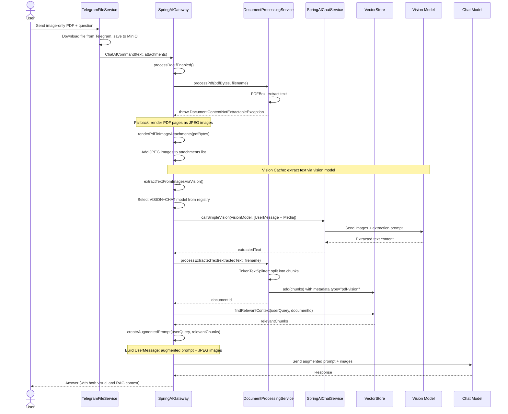
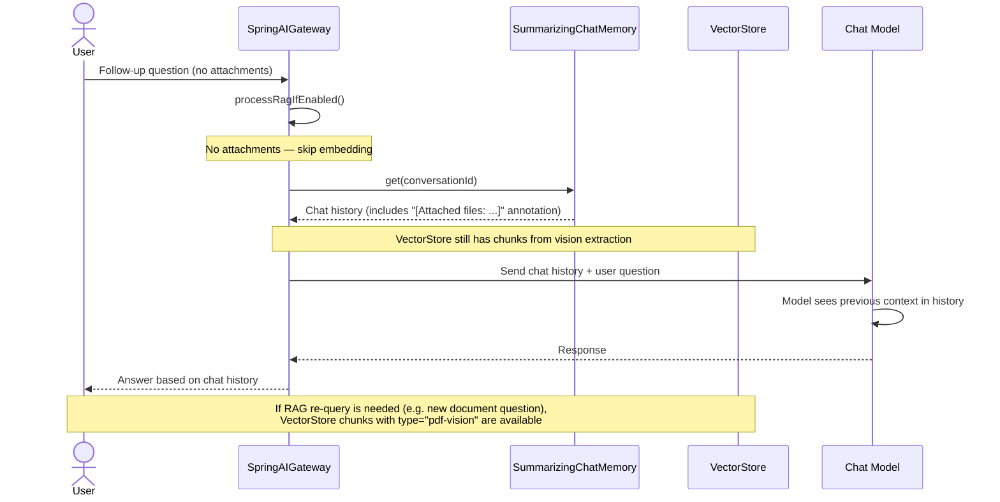

# Image-Only PDF: Vision Cache Sequence Diagram

> **Fixture test:** `ImagePdfVisionCacheFixtureIT` — run with `./mvnw clean verify -pl opendaimon-app -am -Pfixture`

When a user uploads an image-only PDF (scan, certificate, etc.), the system extracts text
via a vision-capable model and caches it in VectorStore for follow-up queries.

## First Message (PDF Upload)

## Follow-Up Message (No Attachments)

## Key Design Decisions

1. **Vision extraction is a separate internal call** — uses `callSimpleVision()` without
   ChatMemory, web tools, or conversationId to avoid polluting chat history.
   Internal token budget is resolved safely even when command chat options are absent.

2. **Extracted text stored as regular RAG chunks** — `type="pdf-vision"` in metadata
   distinguishes them from PDFBox-extracted chunks, but they are searchable via the
   same `FileRAGService.findRelevantContext()`.

3. **First message gets both visual and RAG context** — JPEG images are still sent as
   Media objects for the current message, so the model can "see" the document.
   The augmented prompt with extracted text provides searchable context.
   If final payload contains media, model selection requires `VISION`.

4. **Follow-up messages use RAG** — the vision-extracted text persists in VectorStore,
   so subsequent questions can find relevant chunks via semantic search.
